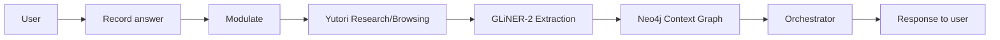

# VoiceCoach — Understand Everything (Flow + Sponsors + Judge Q&A)

One place to explain the app, each sponsor, and how to answer judge questions. Easy language, no code.

---

## Part A — The big picture

VoiceCoach is an **interview coach that adapts by itself**. You don’t pick “easy” or “hard” or “friendly” — the system decides from your voice and your answers.

It combines four main pieces:

- **Modulate** — voice intelligence (transcription + stress / confidence / emotion).
- **Yutori** — live web (fact-check, company brief, scouting).
- **Fastino Labs / Pioneer / GLiNER‑2** — entity extraction (what skills and concepts you mentioned).
- **Neo4j** — the context graph that remembers answers and decisions over time (users, sessions, answers, entities, decisions).

**Modulate** tells us how you said it: stress, confidence, hesitations.  
**Yutori** checks what you said against the live web (fact-check) and reads what the company actually wants (company brief), plus optional ongoing scouting.  
**Fastino Labs’ Pioneer / GLiNER‑2** pulls out competencies (e.g. technical skill, soft skill, framework, impact) from your words using zero‑shot labels.  
**Neo4j** stores those answers, entities, and the coach’s decisions as a **context graph**, and we query it for history and trends so you can trace *why* the coach did what it did.

Together they make the coach autonomous: it changes tone and difficulty from your voice, picks next questions from company brief or your graph history, and adds fact‑check feedback when something you said doesn’t match the web.

---

## Part B — Flow (step-by-step)

1. **Session start**  
   You pick role and company. The backend initializes you in the Neo4j context graph and may create a Yutori Scout for that role and company. The first question comes from the orchestrator (e.g. “Tell me about yourself…”).

2. **Optional: Company brief**  
   You (or the UI) can ask for a company brief. Yutori **Browsing** runs: it opens the company’s careers or job pages, finds a relevant role, and returns expectations, hints, and source URLs. That’s stored on the session and used later to choose the next question.

3. **You record an answer**  
   The frontend sends your audio to the backend.

4. **Per-answer pipeline (in order)**  
   - **Modulate:** Your audio is sent to Modulate’s Velma‑2 STT Batch API. We get transcript plus derived stress score, confidence score, and emotion signals. We also compute a short “voice coaching tip” and a “pacing score” for the UI.  
   - **Yutori Research:** We take a short claim from the transcript (e.g. “I led a team of 10”) and ask Yutori to verify it against the live web: create a research task, poll until it’s done, then get correct/incorrect and optional summary/citations. We show this in the UI and, if the claim was wrong, add a line to the feedback (e.g. “Yutori suggested verifying the claim or citing a source”).  
  - **Fastino Labs / Pioneer GLiNER‑2:** We call **GLiNER‑2** with a role‑aware `schema` (labels like TECHNICAL_SKILL, SOFT_SKILL, FRAMEWORK, IMPACT, CUSTOMER, MODEL, etc.). It returns entities which we both show in the Competency Map and store as structured context.  
  - **Neo4j context graph:** For each answer we write:
     - An `Answer` node (with transcript, stress, confidence, fact‑check status).  
     - `Entity` nodes from GLiNER, linked via `[:MENTIONS]`.  
     - A `Decision` node capturing what the coach did next (tone, difficulty change, next question, feedback text) linked from the answer via `[:LED_TO]` and chained via `[:PRECEDENT_FOR]` to earlier decisions.  
   - **Orchestrator:** It reads recent Modulate history and Neo4j context. Then it combines:  
     - **Tone and difficulty** from Modulate (and the last 3 answers). If 2+ of the last 3 are high stress → supportive + easier; if 2+ are high confidence and low stress → challenging + harder. Otherwise it uses single-answer rules (e.g. high confidence → challenging).  
     - **Feedback text** from Fastino’s profile/query; if Yutori said the claim was wrong, we append a remediation line.  
     - **Next question** from the Yutori company brief if we have it, otherwise from RAG/topics.

5. **What you see**  
   You get the next question, feedback, tone (supportive/neutral/challenging), Modulate summary (stress/confidence bars), fact-check result, a short trend of the last few Modulate scores, GLiNER entities (competency map with counts by label), the voice tip + pacing score, and — behind the scenes — all of this is written into the Neo4j context graph.

A simple view of the pipeline:

---

## Part C — Sponsors: what each does, how we use it, what’s special

### Modulate

- **What it is**  
  A voice analysis API. You send audio; it returns a transcript plus emotion, stress, confidence, hesitation (and optionally deception).

- **What we use**  
  We call Modulate’s **Velma‑2 STT Batch** endpoint (`POST https://modulate-developer-apis.com/api/velma-2-stt-batch`) with your audio as `upload_file` and options for emotion/accent signals. We use: **transcript** (for Yutori and GLiNER), and derived **stress_score** / **confidence_score** plus a pseudo **hesitation_count** to set **tone** (supportive / neutral / challenging) and **difficulty** (easier / harder). We also compute a **voice coaching tip** and **pacing score** from stress and hesitations for the UI.

- **How we use it differently**  
  We don’t just show metrics. We **drive autonomy**: the orchestrator changes coach behavior (tone + difficulty) from Modulate signals and a short history (last 3 answers). There is no “difficulty slider”; the system decides.

- **Specialty**  
  Sub-lexical cues—how you say it, not just what you say.

- **Real-life example**  
  Like a coach who notices you’re rushing or sounding tense and automatically softens the next question or gives you a breathing tip, instead of you clicking “easier mode.”

---

### Yutori

- **What it is**  
  Live web: **Research** (fact-check a claim), **Browsing** (navigate pages and extract info), **Scouting** (ongoing monitoring for a topic).

- **What we use**  
  - **Research:** We create a research task with the user’s claim, poll until it’s done, then get correct/incorrect and summary/citations. We show this in the UI and, if wrong, add a remediation line to the feedback.  
  - **Browsing:** Company brief—a task that opens the company’s careers/job page, finds the role, and summarizes expectations and hints. We store expectations, hints, and source URLs and use them to generate the **next question** (orchestrator prefers company brief first).  
  - **Scouting:** We create a scout per user for role + company and poll for updates; we show “Yutori is watching the web for you” and tips in the UI. If the Yutori API key or billing isn’t set, we fall back to demo updates in-app and the external Scouting dashboard will keep saying “No scouting tasks” until real scouts can be created.

- **How we use it differently**  
  We use **three** Yutori products in one app: fact-check **per answer**, company brief to **shape questions**, and scout for **live tips**. Not just a single “search” call.

- **Specialty**  
  Real-time web: what’s true *now*, and what this company says *now*.

- **Real-life example**  
  Like having a researcher who checks your “I led a team of 10” claim against the web, and a separate assistant who just read the company’s job page and turns that into your next question.

---

### Neo4j

- **What it is**  
  A graph database. We use it as a **context graph** for users, sessions, answers, entities, and decisions.

- **What we use**  
  - **Users and sessions:** On session start we upsert a `User` node with role, company, level, difficulty, and a `Session` node linked via `[:HAS_SESSION]`.  
  - **Answers:** Every answer becomes an `Answer` node with transcript, question, duration, stress, confidence, and whether Yutori said the claim was correct, linked via `[:HAS_ANSWER]`.  
  - **Entities:** GLiNER‑2 entities are stored as `Entity` nodes (`label`, `text`) linked from answers via `[:MENTIONS]`.  
  - **Decisions:** For each question we write a `Decision` node with tone, difficulty change, next question, feedback, and key signals; it links from the answer via `[:LED_TO]` and chains to prior decisions via `[:PRECEDENT_FOR]`.  
  - **Profile / RAG:** We query Neo4j to build a short profile string (answer counts, average stress/confidence, top entity labels) and to fetch recent transcripts as a simple RAG context for the orchestrator and reports.

- **How we use it differently**  
  We treat **decisions as first-class nodes** and link them to answers and entities, so we can reconstruct *why* the coach changed tone or picked a question — not just what was asked.

- **Specialty**  
  Transparent, queryable memory: you can follow edges from a feedback line back to the exact answer, entities, and prior decisions that led to it.

- **Real-life example**  
  Like a coach who not only remembers what you said, but also keeps a graph of “this decision came from that answer mentioning these skills,” so you can audit the path later.

---

### Fastino

- **What it is**  
  A personalization and memory API. In this build we primarily use its **Pioneer GLiNER‑2** integration for entity extraction, plus an optional finetuning hook.

- **What we use**  
  - **GLiNER‑2:** We extract competencies from the transcript (TECHNICAL_SKILL, SOFT_SKILL, FRAMEWORK, etc.) and show them in the UI (Competency Map + counts by label); the same entities are written into Neo4j as structured context.  
  - **Optional Fastino ingest/profile (when keyed):** The service includes helpers to register users and ingest interview answers into Fastino with rich metadata (voice metrics, entities). With a `FASTINO_API_KEY` set, those routes can back more advanced profile/RAG use.  
  - **Pioneer finetuning hook:** We expose a “Trigger Pioneer Optimization” button that simulates (or can trigger) GLiNER‑2 finetuning for this user’s profile.

- **How we use it differently**  
  We don’t just store plain text. We store **multi-sponsor context** (Modulate + Yutori + GLiNER) in Neo4j so future personalization can use voice and fact-check signals. GLiNER is used both for **real-time UI** (competency map) and for structured ingest (either in Neo4j alone, or Neo4j + Fastino when enabled).

- **Specialty**  
  Long-term memory plus structured extraction (skills, frameworks).

- **Real-life example**  
  Like a coach who remembers your last 10 answers, your stress patterns, and which skills you mentioned (e.g. “Python”, “leadership”), and uses that to choose the next question and feedback.

---

## Part D — How to answer judges (short bullets)

- **“How is Modulate used?”**  
  Every answer’s audio is sent to Modulate; we get stress, confidence, hesitation, and transcript. Those drive **automatic** tone (supportive / neutral / challenging) and difficulty, plus a voice tip and pacing score in the UI. No manual setting.

- **“How is Yutori used?”**  
  **Research:** we fact-check a claim from each answer. **Browsing:** we fetch company expectations, hints, and source URLs and use them to pick the next question. **Scouting:** we run a scout per user and show live web tips.

- **“How is Fastino used?”**  
  We use Fastino’s Pioneer GLiNER‑2 to extract competencies and show them (with counts by label) in the UI. When a Fastino key is configured, we can also ingest answers and query profiles/RAG for richer personalization; the always-on context graph in this build is Neo4j.

- **“What’s autonomous?”**  
  Tone and difficulty are chosen from Modulate (and history). Next question comes from the Yutori company brief or Neo4j/RAG context. Feedback comes from the sponsor-native stack (Neo4j profile context plus Modulate/Yutori signals), with a Yutori remediation line when fact-check fails. No human in the loop.
